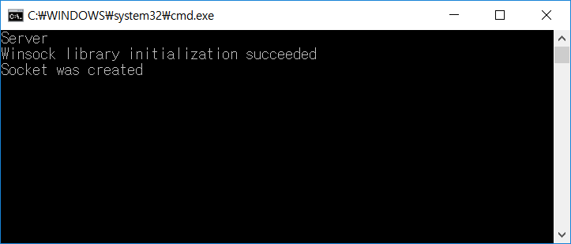
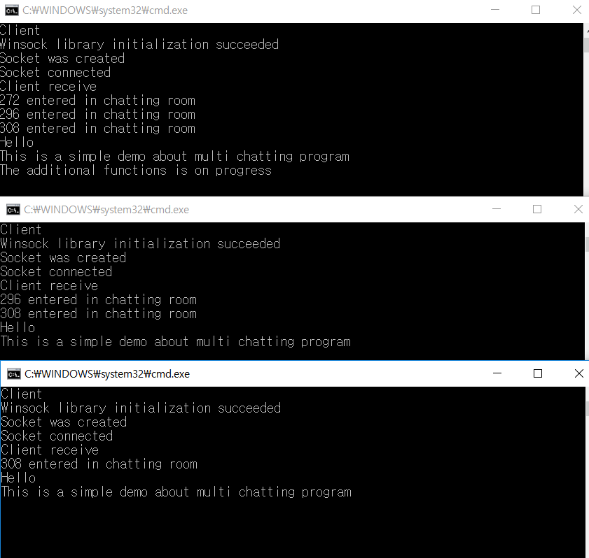

# MultiChat
## What is it?
This is a program for multi chatting and it is implemented by using Versatile Socket 

https://github.com/KimSangYeon-DGU/Versatile_Socket

## What it is used for?
This program is basic but has many potential for scalability.

So, anyone who needs this program can use it.

## DEMO
[Server]

	

[Client]

	

